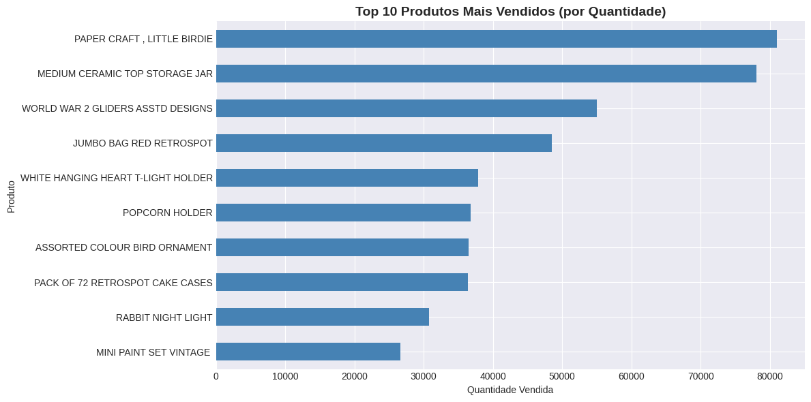
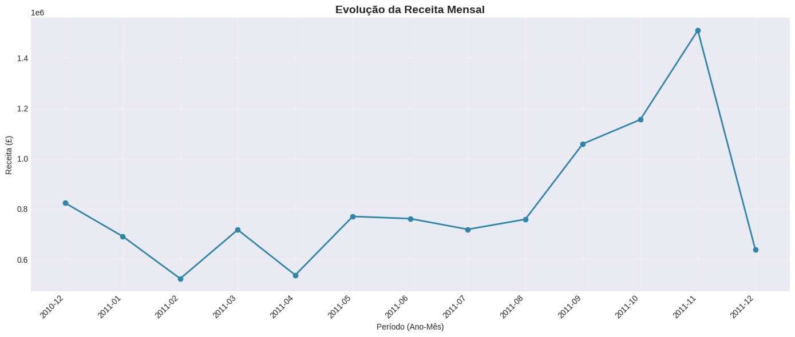

# 🛒 Análise Exploratória de Vendas E-commerce

Projeto de análise exploratória de dados (EDA) aplicado a um dataset de e-commerce internacional, utilizando Python e bibliotecas de análise de dados para extrair insights sobre comportamento de compra, performance de produtos e tendências de vendas.

---

## 📊 Sobre o Projeto

Este projeto realiza uma análise completa de dados de vendas de uma loja online internacional, com foco em:

- Identificação de produtos mais vendidos
- Análise de receita por país e região
- Padrões de sazonalidade nas vendas
- Comportamento de compra dos clientes
- Cálculo de KPIs de e-commerce (ticket médio, receita total, conversão)

---

## 🎯 Objetivos

- Aplicar técnicas de **Análise Exploratória de Dados (EDA)** em dataset real
- Identificar **padrões e tendências** de vendas ao longo do tempo
- Gerar **insights acionáveis** para otimização de estratégias de marketing e vendas
- Demonstrar habilidades em **Python, Pandas, Matplotlib e Seaborn**

---

## 📁 Dataset

- **Fonte:** [UCI Machine Learning Repository - Online Retail Dataset](https://archive.ics.uci.edu/ml/datasets/Online+Retail)
- **Período:** Dezembro/2010 a Dezembro/2011
- **Registros:** ~540.000 transações
- **Campos principais:**
  - `InvoiceNo`: Número da fatura
  - `StockCode`: Código do produto
  - `Description`: Nome do produto
  - `Quantity`: Quantidade vendida
  - `InvoiceDate`: Data da transação
  - `UnitPrice`: Preço unitário
  - `CustomerID`: ID do cliente
  - `Country`: País da compra

---

## 🛠️ Tecnologias Utilizadas

- **Python 3.8+**
- **Pandas** - Manipulação e análise de dados
- **NumPy** - Operações numéricas
- **Matplotlib** - Visualização de dados
- **Seaborn** - Visualizações estatísticas avançadas
---

## 📈 Análises Realizadas

### 1️⃣ **Limpeza e Tratamento de Dados**
- Remoção de valores nulos e duplicados
- Tratamento de transações canceladas
- Criação de coluna de receita total (`Quantity × UnitPrice`)
- Extração de features temporais (ano, mês, dia da semana)

### 2️⃣ **KPIs Principais**
- **Receita Total:** £X milhões
- **Ticket Médio:** £X
- **Total de Transações:** X mil
- **Total de Clientes:** X mil
- **Total de Produtos:** X mil SKUs

### 3️⃣ **Top Produtos Mais Vendidos**
- Identificação dos 10 produtos com maior volume de vendas
- Análise de categorias mais populares

### 4️⃣ **Análise Geográfica**
- Receita por país (Top 10)
- Reino Unido representa ~85% da receita total
- Oportunidades de expansão internacional

### 5️⃣ **Análise Temporal**
- Evolução mensal de vendas (sazonalidade)
- Vendas por dia da semana
- Identificação de períodos de pico (Black Friday, Natal)

### 6️⃣ **Distribuição de Valores**
- Análise de ticket médio
- Identificação de outliers
- Padrões de comportamento de compra

---

## 📊 Principais Visualizações

O notebook inclui:

- ✅ Gráfico de barras: Top 10 produtos mais vendidos
- ✅ Gráfico de barras: Receita por país
- ✅ Gráfico de linha: Evolução temporal de vendas
- ✅ Gráfico de barras: Vendas por dia da semana
- ✅ Histograma: Distribuição de ticket médio
- ✅ Boxplot: Análise de outliers

---

## 💡 Principais Insights

### 🔍 Descobertas

1. **Concentração geográfica:** Reino Unido domina 85%+ das vendas
2. **Sazonalidade:** Pico de vendas em novembro/dezembro (Black Friday e Natal)
3. **Produtos populares:** Itens decorativos e presentes lideram as vendas
4. **Dias úteis performam melhor:** Quinta-feira é o dia com maior receita
5. **Ticket médio:** Maioria das transações abaixo de £100

### 💼 Recomendações

- **Intensificar marketing sazonal** em out/nov/dez
- **Expandir operações internacionais** (foco em países europeus)
- **Estratégias de cross-sell** para produtos decorativos
- **Campanhas mid-week** (terça a quinta-feira)

---

## 🚀 Como Executar o Projeto

### **Opção 1: Google Colab (Recomendado)**

1. Acesse o notebook no Google Colab: [Link do Colab](#)
2. Execute célula por célula (Shift + Enter)
3. O dataset será baixado automaticamente

### **Opção 2: Local**

Clone o repositório
git clone https://github.com/seu-usuario/analise-ecommerce-sales.git

Entre na pasta
cd analise-ecommerce-sales

Instale dependências
pip install pandas numpy matplotlib seaborn openpyxl

Execute o notebook
jupyter notebook Analise_Ecommerce_Sales.ipynb

text

---

## 📂 Estrutura do Repositório

analise-ecommerce-sales/
│
├── Analise_Ecommerce_Sales.ipynb # Notebook principal com análises
├── README.md # Este arquivo
├── dados/ # (Opcional) Dados utilizados
│
└── imagens/ # Prints dos gráficos
 ├── top-produtos.png
 |── evolucao-vendas.png

---

## 📸 Preview dos Resultados

<!-- Adicione prints dos gráficos aqui quando tiver -->

### Top 10 Produtos Mais Vendidos

### Evolução Temporal de Vendas

---

## 🎓 Aprendizados

Este projeto permitiu desenvolver e aplicar:

- ✅ Técnicas de limpeza e pré-processamento de dados
- ✅ Análise exploratória com Pandas
- ✅ Criação de visualizações eficazes com Matplotlib/Seaborn
- ✅ Extração de insights a partir de dados reais
- ✅ Storytelling com dados

---

## 👨‍💻 Autor

**Lucas Artoni Alves**  
Analista de Dados Júnior

---

## 📝 Licença

Este projeto está sob a licença MIT. Veja o arquivo [LICENSE](LICENSE) para mais detalhes.

---

## 🔗 Referências

- [Dataset Original - UCI ML Repository](https://archive.ics.uci.edu/ml/datasets/Online+Retail)
- [Documentação Pandas](https://pandas.pydata.org/docs/)
- [Documentação Matplotlib](https://matplotlib.org/stable/contents.html)
- [Documentação Seaborn](https://seaborn.pydata.org/)

---

⭐ **Se este projeto foi útil, deixe uma estrela!** ⭐
